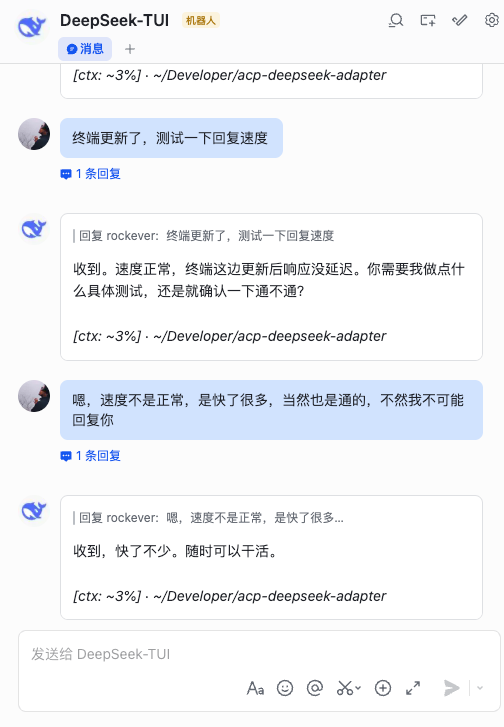

# 🤖 DeepSeek TUI ↔ cc-connect

> **Chat with DeepSeek TUI from your phone — Feishu, WeChat, QQ, Discord, Telegram.**
> **把 DeepSeek TUI 接入飞书、微信、QQ、Discord、Telegram——手机就是终端。**
>
> Full tool-backed ACP — read, write, execute, git, all from IM.
> 完整工具调用支持——读文件、写代码、跑命令、git 操作，全在聊天框里。

---

<p align="center">
  
  
  
  
  
</p>

---

[English](#quick-start) | [中文](#快速开始)



## How it works / 工作原理

```
Feishu / WeChat / QQ / Discord / Telegram
       │
       ▼
  cc-connect (multi-IM bridge)
       │
       ▼  ACP protocol (stdin/stdout)
       │
  acp_deepseek_adapter.py  ←──  YOU ARE HERE
       │
       ▼  deepseek exec --auto
       │
  DeepSeek TUI (agent mode)
       │
       ├─ read_file   ── read project files
       ├─ write_file  ── create / edit files
       ├─ exec_shell  ── run terminal commands
       ├─ git_*       ── version control
       ├─ grep_files  ── search codebase
       └─ ...         ── full tool suite
       │
       ▼
  Response → filtered, batched, styled → back to IM
```

## Quick Start

### 1. Configure cc-connect

Add to `~/.cc-connect/config.toml`:

```toml
[[projects]]
name = "deepseek"

[projects.agent]
type = "acp"

[projects.agent.options]
command = "python3"
args = ["acp_deepseek_adapter.py"]
work_dir = "."
env = { ADAPTER_HIDE_TOOLS = "1", ADAPTER_STRIP_THINKING = "0" }

[[projects.platforms]]
type = "feishu"    # also: weixin, qq, discord, telegram

[projects.platforms.options]
app_id = "your-feishu-app-id"
app_secret = "your-feishu-app-secret"

[projects.auto_compress]
enabled = true
max_tokens = 100000
min_gap_mins = 15
```

### 2. Environment

| Variable | Default | Description |
|----------|---------|-------------|
| `DEEPSEEK_BIN` | `~/deepseek` | Path to deepseek binary |
| `DEEPSEEK_WORKDIR` | `$HOME` | Working directory |
| `ADAPTER_LOG_FILE` | `/tmp/deepseek-ccconnect.log` | Log file path |
| `ADAPTER_STRIP_THINKING` | `1` | Strip thinking tokens (`0` = keep) |
| `ADAPTER_HIDE_TOOLS` | `1` | Hide tool call output (`0` = debug) |
| `KIMI_API_KEY` | *(none)* | Kimi For Coding API key |

### 3. Start

```bash
cc-connect
```

cc-connect manages the adapter process automatically. Restart after config changes.

## 快速开始

### 1. 配置 cc-connect

在 `~/.cc-connect/config.toml` 里加一个 project：

```toml
[[projects]]
name = "deepseek"

[projects.agent]
type = "acp"

[projects.agent.options]
command = "python3"
args = ["acp_deepseek_adapter.py"]
work_dir = "."
env = { ADAPTER_HIDE_TOOLS = "1", ADAPTER_STRIP_THINKING = "0" }

[[projects.platforms]]
type = "feishu"    # 也支持 weixin, qq, discord, telegram

[projects.platforms.options]
app_id = "your-feishu-app-id"
app_secret = "your-feishu-app-secret"

[projects.auto_compress]
enabled = true
max_tokens = 100000
min_gap_mins = 15
```

### 2. 环境变量

| 变量 | 默认值 | 说明 |
|----------|---------|------|
| `DEEPSEEK_BIN` | `~/deepseek` | DeepSeek TUI 二进制路径 |
| `DEEPSEEK_WORKDIR` | `$HOME` | 工作目录 |
| `ADAPTER_LOG_FILE` | `/tmp/deepseek-ccconnect.log` | 日志文件 |
| `ADAPTER_STRIP_THINKING` | `1` | 去掉思考过程 (`0` = 保留) |
| `ADAPTER_HIDE_TOOLS` | `1` | 隐藏工具调用输出 (`0` = 调试) |
| `KIMI_API_KEY` | *(无)* | Kimi 编程模型密钥 |

### 3. 启动

```bash
cc-connect
```

cc-connect 自动管理适配器进程，改完配置重启即可。

## Slash Commands / 斜杠命令

| Command | Description |
|---------|-------------|
| `/dir <path>` | Switch working directory. `/dir -` goes back / 切换工作目录 |
| `/mode default\|yolo` | Change permission mode / 权限模式切换 |
| `/model v4-pro\|v4-flash` | Switch DeepSeek model / 模型切换 |
| `/new [name]` | New session / 新建会话 |
| `/list` | List sessions / 列出会话 |
| `/current` | Current session info / 当前会话 |
| `/memory` | Read/write AGENTS.md / 读写记忆文件 |
| `/compact` | Context usage & compaction status / 上下文压缩 |

## Filter Architecture / 过滤架构

```
Raw output from deepseek exec
       │
       ▼
  ┌─ Phase 1: Tool depth ───── suppress lines between tool: / tool X completed
  │
  ├─ Phase 2: Regex patterns ─ catch diff, git log, JSON, source headers
  │     ├─ _STDOUT_TOOL_FILTER_RE   (tool:, ---, +++, @@, Author:, etc.)
  │     ├─ _JSON_METADATA_RE        (checklist_write, sessionUpdate, etc.)
  │     └─ _SOURCE_HEADER_RE        (shebang, git status, README headers)
  │
  └─ Phase 3: CJK purity ────── drop lines without Chinese characters
       (after first tool call, pure-ASCII lines = internal noise)
       │
       ▼
  Clean output → batched into paragraphs → sent to IM
```

## Background / 背景

DeepSeek TUI already supports `deepseek serve --acp` (issue #782), but the tool_call notification pipeline isn't exposed yet. This adapter bridges that gap using `deepseek exec --auto` until native support lands.

DeepSeek TUI 官方已支持 `serve --acp`，但工具调用链路还没暴露。本项目在官方做完之前，用 `deepseek exec --auto` 自己搭了一套完整的 ACP 桥接。

All pitfalls documented in [issue #1092](https://github.com/Hmbown/DeepSeek-TUI/issues/1092).
踩过的坑都记在 issue #1092。

## Changelog / 更新日志

### v3.9.2
- **Code-noise regex v2**: `_CODE_NOISE_RE` 补上 ps 输出、进程命令行泄漏两个关键模式，切断历史污染反馈循环
- **History repair**: 清理已污染的历史文件条目，防止源码碎片在后续轮次回传

### v3.9.1
- **Auto-compress**: cc-connect 项目配置加入 `auto_compress`，上下文达 100k token 自动触发压缩（15 分钟间隔），与终端设置同步

### v3.9.0
- **Streaming output**: 输出分段缓冲，首段即时响应，后续内容合并为 2-3 段，减少 IM 消息碎片
- **Section separators**: 段落间插入 `---` 分隔线，飞书渲染为可见分段
- **Triple-layer filter**: 三层过滤体系（正则 + 工具深度 + CJK 字符检测），彻底拦截源代码/diff/shell/git log 泄漏
- **CJK purity filter**: 工具调用后，不含中文字符的行自动丢弃，杜绝英文代码穿透
- **History cleanup**: 防污染机制，已知泄漏模式不存入对话历史，切断自循环
- **Footer**: 恢复 `[ctx: ~X%]` 上下文用量显示
- **Regex expansion**: 新增 shebang、git status short、git log、grep -n 等 10+ 条过滤规则

## Links / 链接

<p align="center">
  <a href="https://github.com/rockeverm3m/acp-deepseek-adapter">adapter repo / 适配器仓库</a>
  ·
  <a href="https://github.com/Hmbown/DeepSeek-TUI">DeepSeek TUI</a>
  ·
  <a href="https://github.com/cc-connect/cc-connect">cc-connect</a>
</p>

---

<p align="center">
  <sub>Built by talking to DeepSeek TUI through Feishu, overnight, by someone who doesn't code.<br>
  本项目由 DeepSeek TUI 自身辅助开发完成——一个不懂代码的小白，在飞书上对话一个通宵就做出来了。</sub>
</p>
